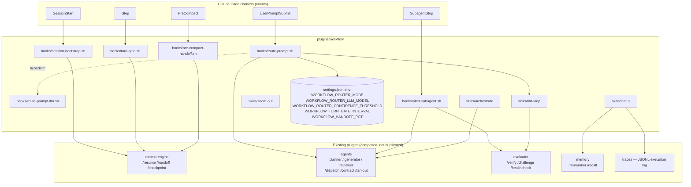
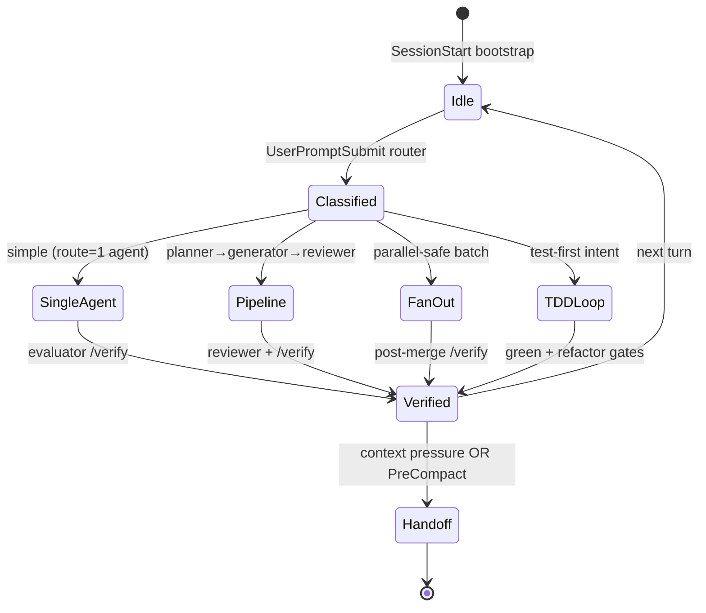

# Agentic Workflow

**One-line**: the Forge Studio `workflow` plugin is a hook-driven orchestration layer that composes existing plugins (agents, evaluator, context-engine, memory, traces) into an autonomous development loop. Manual ceremony removed; routing, verification, and handoffs happen automatically.

---

## 1. What & Why

### The problem with the old design

The previous `workflow` plugin exposed eight manual skills (`/morning`, `/route`, `/explore`, `/plan`, `/implement`, `/eod`, `/weekly`, `/zoom-out`). The orchestrator was the human — the plugin was a menu. Two consequences:

1. **Coordination by ceremony.** Steps were skipped when the user forgot, or invoked out of order when the user guessed. There was no enforcement mechanism.
2. **Duplication.** Routing duplicated `agents:/dispatch`. Planning/implementation shadowed the `planner`/`generator` subagents. "Morning" and "end-of-day" did what `context-engine:/resume` and `context-engine:/handoff` already do.

### The new design

Hooks replace manual skills for routine coordination. Skills remain as manual escape hatches. Every decision that needed a human command now happens on a harness event (`SessionStart`, `UserPromptSubmit`, `SubagentStop`, `Stop`, `PreCompact`). The plugin itself re-dispatches to existing marketplace plugins rather than reimplementing their capabilities.

### Research foundation (not assumptions)

| Source | Lesson used here |
|---|---|
| Anthropic, *Building Effective Agents* + cookbook `orchestrator_workers.ipynb` | Router pattern cuts inference cost ~40% with <2% quality loss when routing accuracy exceeds 95%. Used as the shape of `route-prompt.sh`. |
| Anthropic, *How We Built Our Multi-Agent Research System* | Scaling rules: 1 agent for simple fact-finding; 2–4 for comparisons; 10+ only for complex research. Multi-agent uses ~15× more tokens than chat; token usage alone explains 80% of performance variance. Parallel subagents cut wall-clock by up to 90%. Informs router thresholds + fan-out batch size. |
| Anthropic, *Infrastructure Noise in Agentic Coding Evals* | Separate guaranteed resource floor from hard kill threshold; 3× ceiling cut infra error rate from 5.8% to 2.1%. Generalized here as "resume over restart" and advisory-over-blocking for non-critical hooks. |
| mattpocock/skills `tdd` + alexop.dev *Custom TDD Workflow for Vue* | Vertical RED→GREEN→REFACTOR with real-command gates; per-phase context isolation raised skill activation from ~20% to ~84%. Direct spec for `/tdd-loop`. |
| Leviathan et al., *Speculative Decoding* (arXiv 2211.17192) + Mohri et al., *Hierarchical Speculative Decoding* (arXiv 2510.19705) | Draft-and-verify pattern validates the existing planner→generator→reviewer triad. |
| Asawa et al., *How to Train Your Advisor* (arXiv 2510.02453) | Small, file-backed advisory docs steer frontier models (71% gain on RuleArena Taxes, 24.6% step reduction in SWE tasks, transferable across model sizes). Corroborates the sprint-contract design: write a plan with a `## Contract` section once; let every subsequent agent re-read it from disk. |
| Claude Code docs (hooks-guide, 2026) | `SessionStart`, `UserPromptSubmit`, `Stop`, `SubagentStop`, `PreCompact` are the canonical events for deterministic automation. |

---

## 2. Architecture

### Component view



### State transitions for a typical turn



### Full turn sequence (feedback loops explicit)

```mermaid
sequenceDiagram
  autonumber
  participant U as User
  participant H as Harness
  participant W as workflow hooks
  participant A as agents plugin
  participant E as evaluator plugin
  participant C as context-engine

  U->>H: prompt
  H->>W: UserPromptSubmit
  W-->>W: route-prompt.sh (shell)
  alt low confidence + hybrid/llm
    W-->>W: route-prompt-llm.sh (Haiku)
  end
  W-->>H: advisory (route + suggestion)
  H->>A: /dispatch (when route=pipeline)
  A->>A: planner (read-only)
  A->>H: SubagentStop(planner)
  H->>W: after-subagent.sh → "generator next; check contract"
  A->>A: generator (read-write, re-reads /contract)
  A->>H: SubagentStop(generator)
  H->>W: after-subagent.sh → "reviewer next"
  A->>A: reviewer (read-only)
  A->>H: SubagentStop(reviewer)
  H->>W: after-subagent.sh → "run /verify"
  H->>E: /verify (evidence-based)
  E-->>H: verdict
  H->>W: Stop → turn-gate.sh
  alt unchecked plan items OR pressure ≥ threshold
    W-->>H: nudge /handoff
    H->>C: /handoff
  end
  opt auto-compact imminent
    H->>W: PreCompact → pre-compact-handoff.sh
    W-->>H: advisory nudge /handoff
  end
```

The arrows are **advisories**, not hard control flow. Every hook exits 0 with text — the model remains in charge. This is deliberate: per Anthropic's noise paper, hard fails on orchestration events create more noise than they prevent.

---

## 3. Harness mapping (7-component model)

| # | Harness component | How this plugin touches it |
|---|---|---|
| 1 | System Prompts | No changes; `behavioral-core` owns this. |
| 2 | Tool System | No new restrictions; reuses `agents` plugin tool boundaries. |
| 3 | Permission System | Does not block. Blocking stays in `behavioral-core` / `research-gate`. |
| 4 | Context Management | `turn-gate.sh` + `pre-compact-handoff.sh` nudge `context-engine:/handoff` before state loss. |
| 5 | Memory Architecture | `/status` reads memory index; `/orchestrate` suggests `/remember` for decisions. |
| 6 | Multi-Agent Decomposition | The `UserPromptSubmit` router + `SubagentStop` nudges orchestrate `agents:planner/generator/reviewer`. |
| 7 | Behavioral Steering | Re-reads the plan's `## Contract` section (sprint-contract protocol) to counter attention drift. |

---

## 4. Cost-efficiency

The plugin is engineered to spend as little as possible:

- **Shell-first router** (`WORKFLOW_ROUTER_MODE=shell`, default): zero token cost per prompt. Anthropic's data: router adoption alone cuts LLM inference ~40%.
- **LLM fallback is opt-in** (`hybrid` or `llm`): escalates to Haiku only when shell confidence falls below `WORKFLOW_ROUTER_CONFIDENCE_THRESHOLD` (default 0.75). In `hybrid` mode, a well-tuned shell ruleset handles the 95%+ majority without any API call.
- **`disable-model-invocation: true`** on every skill per Forge Studio convention: zero cost until manually invoked. The model never "accidentally" loads a skill during normal reasoning.
- **Sub-agent context isolation** (`context: fork` for `/tdd-loop` phases, inherited from the Explore/Plan subagents). Subagent contexts don't back-propagate into the orchestrator's prompt — matches Anthropic's finding that token usage alone explains 80% of multi-agent performance variance.
- **File-based sprint contract**. The plan lives on disk. Instead of re-summarizing scope into every subagent prompt (expensive and lossy), subagents re-read the contract via `agents:/contract`. One write, many reads.
- **Rate-limited nagging**. `turn-gate.sh` fires every `WORKFLOW_TURN_GATE_INTERVAL` turns (default 3), not every turn. Noise reduction is explicit.
- **Batch size ceiling of 3–5** for `fan-out` (Anthropic's multi-agent sweet spot). Larger fan-outs produce diminishing returns with super-linear review cost.

Per-plugin overhead (roughly):

| Event | Tokens added | Notes |
|---|---|---|
| SessionStart (bootstrap) | ~80–150 one-time | Handoff summary + plan item count. |
| UserPromptSubmit (shell mode) | 0 | Shell only; advisory emitted only when route is confident. |
| UserPromptSubmit (hybrid escalation) | ~150 on escalation | Haiku classifier; only fires when shell unsure. |
| SubagentStop | 0–40 | Phase-transition nudge. Silent when no plan is active. |
| Stop (turn-gate) | 0–100 every N turns | Plan-item and pressure reminders. Silent when clean. |
| PreCompact | 0–80 | Advisory on auto-compact only. |

---

## 5. Scalability

- **Parallel decomposition** delegated to `agents:/fan-out`. Anthropic's guidance pins us to 3–5 workers per batch; larger batches degrade review-ability and fan-out diminishing returns kick in.
- **Durable steering across compaction**. Sprint contract on disk (`.claude/plans/*.md` with `## Contract` section). Plans survive compaction; summaries in memory do not. The advisor-model result (arXiv 2510.02453) is the theoretical basis: 71% accuracy gain on RuleArena (Taxes) from persistent, small per-instance advisory docs.
- **Hierarchical verification**. The planner→generator→reviewer→`/verify` chain mirrors hierarchical speculative decoding (arXiv 2510.19705): cheap drafts, incrementally more expensive verification layers. Each stage uses the minimum-capable tool isolation needed for its role.
- **Trace-driven self-improvement**. Router writes classifications to `/tmp/claude-router-<session>/classifications.jsonl`. The `traces` plugin collects execution traces. Periodic `/trace-evolve` (traces plugin) mines both to propose ruleset tweaks — the system gets smarter from its own mistakes without hand-tuning.

---

## 6. Reliability (error recovery + noise reduction)

Applied from Anthropic's *Infrastructure Noise* principles:

| Failure mode | Mitigation |
|---|---|
| Subagent crashes mid-pipeline | Sprint contract + handoff file mean the next invocation resumes from disk, not from in-context state. "Resume over restart" (Anthropic). |
| Context compaction mid-turn | `pre-compact-handoff.sh` nudges `/handoff` *before* compaction so decisions persist. We don't block (advisory only) — `context-engine`'s own `pre-compact-guard` already blocks when genuinely destructive. Stacking blocks creates noise without added safety. |
| Router misclassifies | Advisory emits; user or model overrides by invoking `/orchestrate <pattern>` explicitly. Classifications are logged; periodic review tunes the ruleset. |
| LLM fallback unreachable (no `claude` CLI or API key) | `route-prompt-llm.sh` silently returns empty → caller falls back to shell result. Graceful degradation. |
| Nag fatigue | `turn-gate.sh` rate-limits; `after-subagent.sh` silent when no active plan; all hooks follow "silent on success" invariant. |
| Stale plan ignored | `turn-gate.sh` counts unchecked `- [ ]` items every N turns; `SubagentStop` points back at the contract. Drift is visible, not silent. |

None of the new hooks exits with code 2 except by delegation. Advisory-first design keeps orchestration robust under model uncertainty.

---

## 7. Configuration reference

All configuration lives in `settings.json` under `env`. Example user settings:

```json
{
  "env": {
    "WORKFLOW_ROUTER_MODE": "hybrid",
    "WORKFLOW_ROUTER_LLM_MODEL": "claude-haiku-4-5-20251001",
    "WORKFLOW_ROUTER_CONFIDENCE_THRESHOLD": "0.75",
    "WORKFLOW_TURN_GATE_INTERVAL": "3",
    "WORKFLOW_HANDOFF_PCT": "75"
  }
}
```

| Variable | Values | Default | Effect |
|---|---|---|---|
| `WORKFLOW_ROUTER_MODE` | `shell`, `hybrid`, `llm` | `shell` | `shell` = regex classifier only (zero cost). `hybrid` = shell first, escalate to Haiku on low confidence. `llm` = always ask Haiku (highest cost, highest accuracy). |
| `WORKFLOW_ROUTER_LLM_MODEL` | any Claude model ID | `claude-haiku-4-5-20251001` | Model used by the LLM fallback. Cheaper = better if accuracy is sufficient. |
| `WORKFLOW_ROUTER_CONFIDENCE_THRESHOLD` | 0.0–1.0 | `0.75` | In `hybrid`, shell results below this escalate. |
| `WORKFLOW_TURN_GATE_INTERVAL` | integer ≥ 1 | `3` | `turn-gate.sh` emits only every N turns. Higher = quieter. |
| `WORKFLOW_HANDOFF_PCT` | integer 0–100 | `75` | Context pressure at/above this triggers `/handoff` nudge. |

Disable the router entirely: set `WORKFLOW_ROUTER_MODE=shell` and ignore the emitted nudges, or `/plugin disable workflow@forge-studio`.

---

## 8. Migration from the old workflow

| Old manual skill | What it did | Replacement |
|---|---|---|
| `/morning` | Review handoffs, show plan, ask "what's the ONE thing?" | `SessionStart` hook surfaces handoff + plan items automatically; user owns prioritization. |
| `/route` | Pick the right pattern for a task | `UserPromptSubmit` hook classifies; `agents:/dispatch` finalizes. |
| `/explore` | Read-only subagent investigation | Built-in `Explore` subagent. Invoke via `/orchestrate` or Task tool. |
| `/plan` | Produce an implementation plan | `agents:planner` subagent writes to `.claude/plans/` with a `## Contract` section. |
| `/implement` | Execute plan step-by-step with scope checks | `agents:generator` subagent + `agents:/contract` for plan re-read. |
| `/eod` | End-of-day log + handoff suggestion | `Stop` hook nudges `/handoff` when the session has drift. The daily-log artifact is replaced by `context-engine:/handoff` + `memory:/remember`. |
| `/weekly` | Retrospective | Schedule via the `schedule` skill (reference plugin) or run `traces:/trace-evolve` on demand. |
| `/zoom-out` | "Give me the map" | Retained unchanged. |

Everything the old skills provided is either automated by a hook or produced by a more specialized plugin. Nothing valuable was removed — only the ceremony.
