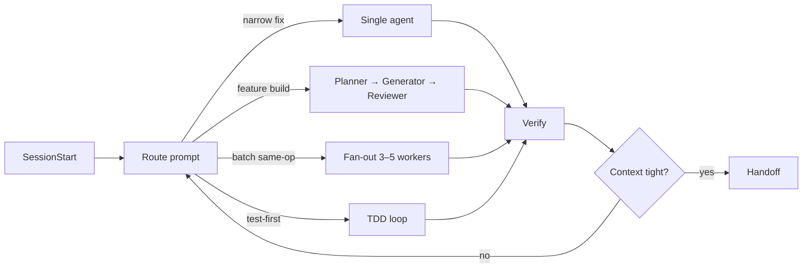

# Agentic Workflow

The `workflow` plugin automates how Claude Code moves through a development session. It classifies every prompt, dispatches the right multi-agent pattern, enforces the sprint contract across subagents, and nudges a handoff before context is lost — all through harness hooks, with zero manual commands on the happy path.

---

## Install

```bash
/plugin install workflow@forge-studio
```

Recommended companion plugins (the workflow leans on their skills):

```bash
/plugin install agents@forge-studio           # planner / generator / reviewer + /dispatch /fan-out /contract
/plugin install evaluator@forge-studio        # /verify /challenge /healthcheck
/plugin install context-engine@forge-studio   # /checkpoint /audit-context /token-pipeline
/plugin install long-session@forge-studio     # /progress-log /session-resume /init-sh /feature-list
/plugin install memory@forge-studio           # /remember /recall
```

Restart the session once. The hooks arm themselves on the next `SessionStart`.

---

## How a session flows



Five hook events drive the pipeline:

| Event | What the hook does |
|---|---|
| `SessionStart` | Surfaces the latest handoff and any unchecked items in the active plan. |
| `UserPromptSubmit` | Classifies the prompt (shell regex, optional Haiku fallback) and suggests the right pattern. |
| `SubagentStop` | Points the conversation at the next phase (planner → generator → reviewer → `/verify`). |
| `Stop` | Every N turns, reminds about unchecked plan items and context pressure. |
| `PreCompact` | Advises `/progress-log` before auto-compaction. |

Every hook is advisory. Nothing blocks. The model stays in charge.

---

## Configuration

All settings live under `env` in `~/.claude/settings.json` or the project's `.claude/settings.json`:

```json
{
  "env": {
    "WORKFLOW_ROUTER_MODE": "shell",
    "WORKFLOW_ROUTER_LLM_MODEL": "claude-haiku-4-5-20251001",
    "WORKFLOW_ROUTER_CONFIDENCE_THRESHOLD": "0.75",
    "WORKFLOW_TURN_GATE_INTERVAL": "3",
    "WORKFLOW_HANDOFF_PCT": "75"
  }
}
```

| Variable | Default | Purpose |
|---|---|---|
| `WORKFLOW_ROUTER_MODE` | `shell` | `shell` (regex only, zero tokens), `hybrid` (shell first, Haiku when uncertain), `llm` (always Haiku). |
| `WORKFLOW_ROUTER_LLM_MODEL` | `claude-haiku-4-5-20251001` | Model the LLM fallback uses. |
| `WORKFLOW_ROUTER_CONFIDENCE_THRESHOLD` | `0.75` | In `hybrid`, shell results under this threshold escalate to the LLM. |
| `WORKFLOW_TURN_GATE_INTERVAL` | `3` | Stop-hook fires every N turns. Higher = quieter. |
| `WORKFLOW_HANDOFF_PCT` | `75` | Context pressure % that triggers the handoff nudge. |

The router also logs every classification to `/tmp/claude-router-<session_id>/classifications.jsonl` — useful for auditing accuracy and tuning.

### Token overhead per event

What to expect the plugin to cost, per event:

| Event | Tokens added | Notes |
|---|---|---|
| `SessionStart` | ~80–150 one-time | Handoff summary + unchecked plan item count. |
| `UserPromptSubmit` (shell mode) | 0 | Advisory emitted only when routing confidence is high. |
| `UserPromptSubmit` (hybrid escalation) | ~150 on escalation | Haiku classifier fires only when shell is uncertain. |
| `SubagentStop` | 0–40 | Phase-transition nudge. Silent when no plan is active. |
| `Stop` | 0–100 every N turns | Plan-item + pressure reminders. Silent on clean state. |
| `PreCompact` | 0–80 | Advisory on auto-compact only. Manual `/compact` is silent. |

Rate-limiting (`WORKFLOW_TURN_GATE_INTERVAL`) and silent-on-success hook behavior keep steady-state overhead near zero for short tasks.

---

## Skills

Four user-invocable skills. All start with `/`.

| Skill | Argument | What it does |
|---|---|---|
| `/orchestrate` | `[single\|pipeline\|fan-out\|tdd\|auto]` | Manually dispatches the active plan through the chosen pattern. Defaults to `auto`. |
| `/tdd-loop` | `<feature-or-bug-description>` | Runs RED → GREEN → REFACTOR with real-command completion gates. Each phase runs in an isolated subagent context. |
| `/status` | — | Compact situation report: active plan, last handoff, recent traces, context pressure, router stats. |
| `/zoom-out` | — | Asks for a higher-level map of an unfamiliar area of the codebase. |

---

## Examples

### 1. Narrow fix — the router stays out of the way

```text
> fix the typo "recieve" in UserProfile.vue
```

The shell classifier sees a narrow verb + short prompt → routes `single-agent`. The hook emits one line:

```text
[workflow router] route=single-agent confidence=0.85 reason=narrow change, single-file verb
Narrow change detected. Execute directly; skip the planner→generator→reviewer pipeline.
```

Claude edits the file, runs the project's test command, done. No planner, no reviewer, no extra tokens.

### 2. Feature build — full pipeline with a sprint contract

```text
> implement a subscription upgrade flow across the billing and notifications modules
```

Router classifies `pipeline`. Behavior you'll see:

1. The **planner** (read-only subagent) explores `app/Billing/` and `app/Notifications/`, writes `.claude/plans/subscription-upgrade.md` containing a `## Contract` section with testable criteria:

   ```md
   ## Contract
   - [ ] POST /billing/subscription/upgrade returns 200 with new plan_id
   - [ ] NotificationDispatcher emits subscription.upgraded event
   - [ ] Feature flag `BILLING_UPGRADE_V2` gates the new path
   Verification method: ./vendor/bin/pest --filter=SubscriptionUpgrade
   ```

2. `SubagentStop` fires → the workflow hook emits:
   ```
   [workflow] Planner finished. Next: dispatch the generator. Ensure the plan has a ## Contract section before generating.
   ```

3. The **generator** (read-write subagent) invokes `/contract` first to re-read the criteria from disk (survives any context compaction between planner and generator), then implements.

4. `SubagentStop` → hook nudges the **reviewer**. The reviewer has no Write/Edit tools, so it must flag issues instead of "fixing" them (keeps evaluation honest).

5. `SubagentStop` → hook nudges `/verify`. The evaluator plugin runs the contract's verification command and returns an evidence-backed verdict.

6. If `$CLAUDE_CONTEXT_WINDOW_USED_PCT ≥ 75`, the `Stop` hook suggests `/progress-log` so the decisions persist into the next session.

### 3. Fan-out — parallel batch

```text
> rename the Logger import across all components in every module of src
```

Router classifies `fan-out` (batch verb + "across all" + target nouns). Suggested:

```text
Parallel-safe batch detected. Consider /fan-out (agents plugin) with 3–5 workers per batch.
```

Run `/fan-out` from the agents plugin. It dispatches 3–5 subagents (the Anthropic sweet spot for review-able parallelism), each operating on a disjoint file list. When all return, the orchestrator merges and you run `/verify` once.

### 4. TDD loop — three phases, three real-command gates

```text
> /tdd-loop reproduce the bug where UserProfile.logout() leaves stale tokens
```

Phase output you will see:

```text
RED phase
  Writes tests/Feature/LogoutLeaksTokenTest.php asserting empty token cache after logout()
  Runs: ./vendor/bin/pest tests/Feature/LogoutLeaksTokenTest.php
  Gate passes: exit code non-zero, message matches "expected cache to be empty"

GREEN phase (fresh context)
  Edits UserProfile.php: adds TokenCache::forget($userId) to logout()
  Runs: ./vendor/bin/pest tests/Feature/LogoutLeaksTokenTest.php
  Gate passes: exit 0

REFACTOR phase (reviewer agent, read-only)
  Checklist: dup logic, naming, unnecessary conditionals
  Result: "No refactoring needed — single-line fix, matches existing TokenCache call sites"
  Runs full suite: ./vendor/bin/pest
  Gate passes: exit 0
```

If any gate fails, the phase stops and reports the real output. No "I think it passes" claims.

### 5. End-of-session handoff

Near the end of a long session, `Stop` fires after a turn and the hook emits:

```text
[workflow] Plan subscription-upgrade.md has 2 unchecked items. Update the plan or reconcile before claiming done.
[workflow] Context at 78%. Run /progress-log (context-engine) before compaction risks information loss.
```

You run `/progress-log billing-upgrade`. A `.claude/progress-logs/2026-04-20-billing-upgrade.md` is written with done / in-progress / blockers / decisions / next-steps. Next session, `SessionStart` surfaces it:

```text
[workflow] Last handoff: 2026-04-20-billing-upgrade.md (0d ago). Run /session-resume to load it.
[workflow] Active plan: subscription-upgrade.md (2 unchecked items).
```

`/session-resume` picks up where you left off.

### 6. Asking for an override

Sometimes the router picks wrong. Force the pattern explicitly:

```text
> /orchestrate tdd
```

The skill reads the active plan, ignores the router's classification, and hands off to `/tdd-loop`. Advisory hooks never block you from overriding.

---

## Checking live state

```text
> /status
```

Typical output:

```text
Plan:     subscription-upgrade.md (0d old, 5/7 done)
Handoff:  2026-04-20-billing-upgrade.md (0d ago) — /session-resume to load
Traces:   31 events, last: Bash pest --filter=SubscriptionUpgrade
Pressure: 62% (Moderate) — consider /compact
Router:   pipeline:3 single-agent:2 tdd-loop:1
```

Silent sections are omitted — no "None" spam.

---

## Gotchas and failure modes

| Situation | What happens | How to recover |
|---|---|---|
| Shell classifier can't decide | Router stays silent. No nudge, no cost. | Invoke `/orchestrate <pattern>` to force a dispatch. |
| `claude` CLI missing in hybrid mode | `route-prompt-llm.sh` returns empty; shell verdict is used. | Install the CLI or set `WORKFLOW_ROUTER_MODE=shell`. |
| Plan has no `## Contract` section | Subagent-transition nudges still fire, but carry less information. | Add the section. Contract-backed runs survive compaction; loose plans do not. |
| Subagent crashes mid-pipeline | State is on disk (`.claude/plans/*.md`). Nothing is lost. | Next turn, re-dispatch from the plan — don't restart. |
| `turn-gate.sh` warns every 3 turns and it's noisy | Bump `WORKFLOW_TURN_GATE_INTERVAL` to `5` or `10`. | Setting takes effect next session. |
| Auto-compaction imminent, handoff not yet written | `pre-compact-handoff.sh` emits an advisory. | Run `/progress-log` before the compaction fires. The hook does not block compaction. |

Hooks are advisory — none exit with code 2. They surface signals; the decision stays with you and Claude.

---

## See also

- [Architecture](architecture.md) — 7-component harness model + hook mechanics
- [Harness Spec](../HARNESS_SPEC.md) — Sprint Contract Protocol (§ Sprint Contract Protocol)
- [Settings](settings.md) — full env-var reference including the `WORKFLOW_*` variables
- [Lifecycle](../plugins/workflow/LIFECYCLE.md) — event → hook → composed-plugin map
